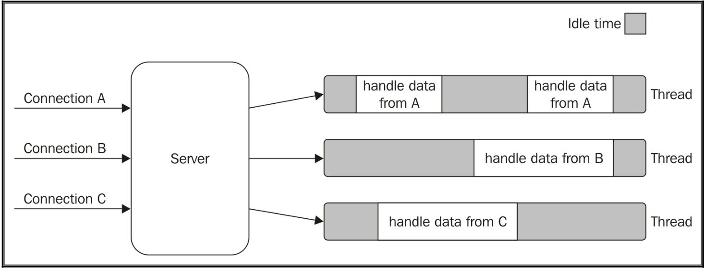
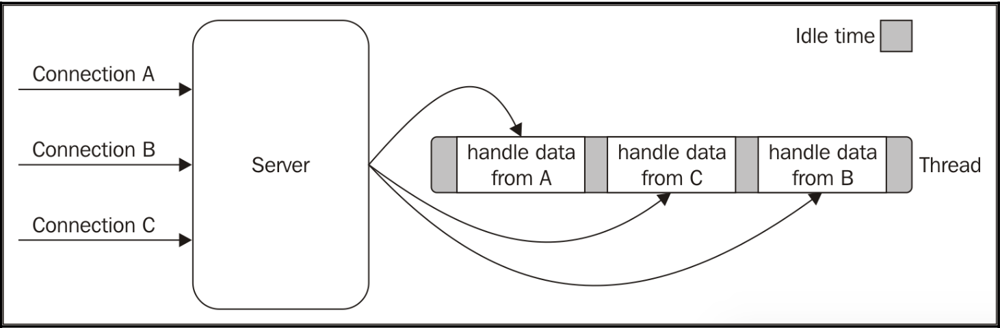
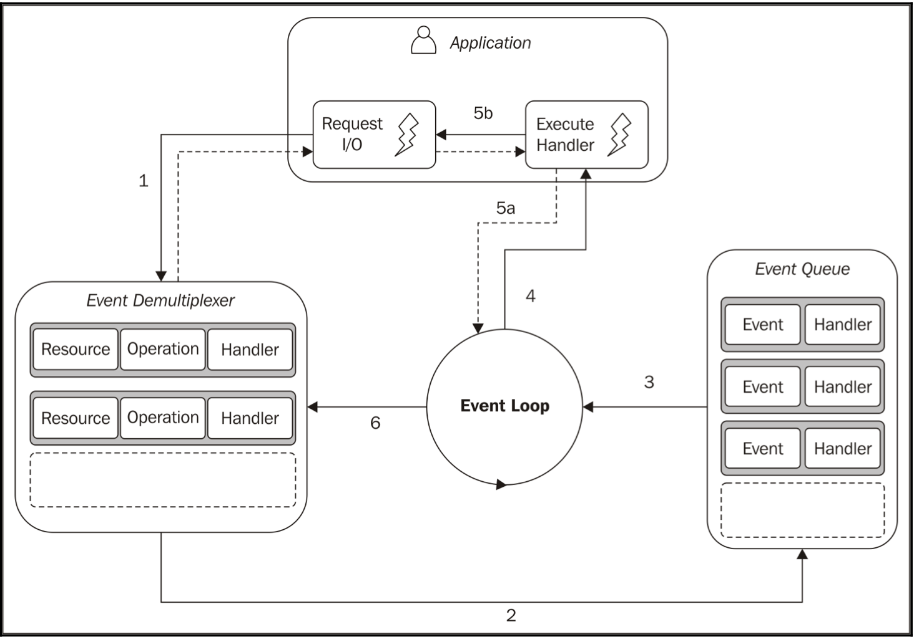

## Introduction

Reactor pattern is the heart of the asynchronous nature of Node.js. Here's the main concepts:

- Single-threaded architecture
- Non-blocking I/O

## What it's I/O

**According to wikipedia**

> Is the communication between an information processing system, such as a computer, and the outside world, possibly a human or another information processing system. Inputs are the signals or data received by the system and outputs are the signals or data sent from it, to "perform I/O" is to perform an input or output operation.

## Bloking I/0

The function corresponding to an I/O request will block the execution on the thread until the operation completes.

```javascript
//blocks the thread until the data is available

data = socket.read();

// data is avaible
print(data);
```



It emphasis the idle time each connection is waiting for new data to be received from the associated connection.

image lays emphasis on the amount of time each thread is idle, waiting for new data to be received from the associated connection. Unfortunately, a thread is not cheap in terms of system resources, it consumes memory and causes switch contexts, so having long thread for each connection is not the best compromise in terms of efficiency.

## Non-blocking I/O

In this operating mode, the system call always returns inmediately without waiting for the data to be read or written. If no results are available at the moment of the of call, the function will simply return a predefined constant indicating that there is no data available to return at the moment.

The most basic pattern for accesing this kind of non-blocking I/O is to actively poll the resource within a loop until some data is returned, **busy-waiting**.

```javascript
resoucers = [socketA, socketB, pipeA];

while (!resources.isEmpty()) {
  for (i = 0; i < resources.length; i++) {
    resource = resources[i];
    // try to read
    let data = resource.read();
    if(data === NO_DATA_AVAILABLE)
    //there is no data to read at the moment continue;
    if(data === RESOURCE_CLOSED)
    //the resource was closed, remove it from the list resources.remove(i);
          else
            //some data was received, process it
            consumeData(data);
      }
}
```

The loop will only consume precious CPU for iterating over resources that are unavailable most of the time. Polling algorithms usually result in a huge amount of wasted CPU time.

## Event demultiplexing

This component collects and queues I/O events that come from a set of watched resources, and block until new events are available to process.

```javascript
socketA, pipeB;

watchedList.add(socketA, FOR_READ);

watchedList.add(pipeB, FOR_READ);

while ((events = demultiplexer.watch(watchedList))) {
  // event loop

  foreach(event in events) {
//This read will never block and will always return data data = event.resource.read();
  if(data === RESOURCE_CLOSED)
          //the resource was closed, remove it from the watched list
  demultiplexer.unwatch(event.resource); else
          //some actual data was received, process it
          consumeData(data);
      }
}
```

It's interesting to see that with this pattern, we can now handle several I/O operations inside a single thread, without using a busy-waiting technique.



## Reactor pattern

The main idea behind it is to have a handler (which in Node.js is represented by a callback function) associated with each I/O operation, which will be invoked as soon as an event is produced and processed by the event loop.



The application generates a new I/O operation by submitting a request to the Event Demultiplexer. The application also specifies a handler, which will be invoked when the operation completes. Submitting a new request to the Event Demultiplexer is a non-blocking call and it immediately returns control to the application.

2. When a set of I/O operations completes, the Event Demultiplexer pushes the new events into the Event Queue.
3. At this point, the Event Loop iterates over the items of the Event Queue.
4. For each event, the associated handler is invoked.
5. The handler, which is part of the application code, will give back control to the Event Loop when its execution completes (5a). However, new asynchronous operations might be requested during the execution of the handler (5b), causing new operations to be inserted in the Event Demultiplexer (1), before control is given back to the Event Loop.
6. When all the items in the Event Queue are processed, the loop will block again on the Event Demultiplexer which will then trigger another cycle when a new event is available.
